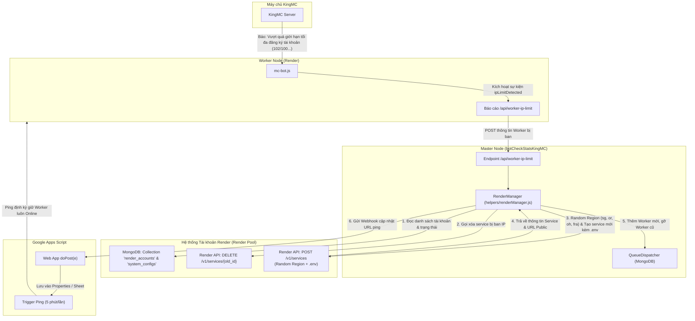

# 📋 KẾ HOẠCH HỆ THỐNG TỰ ĐỘNG XOAY TÀI KHOẢN RENDER KHI ĐẠT GIỚI HẠN IP (MULTI-ACCOUNT RENDER ROTATION)

---

## 1. Tổng quan & Mục tiêu (Overview & Objective)

Hệ thống quản lý cụm Worker bot Minecraft (chạy trên hạ tầng Render) tự động phát hiện khi một Worker bị **đạt giới hạn đăng ký tài khoản theo IP** hoặc **bị ban IP** từ máy chủ KingMC. Khi điều kiện này được thỏa mãn:
1. **Chỉ kích hoạt** khi gặp đúng thông báo giới hạn IP/ban IP từ server KingMC (các trường hợp disconnect, lag, chết trong game... vẫn xử lý reconnect như bình thường).
2. Tự động xoay vòng qua **Pool nhiều tài khoản Render** (`config/render_accounts.json`).
3. **Random chọn khu vực (Region)** (ví dụ: `singapore`, `oregon`, `ohio`, `frankfurt`) để nhận được dải IP Outbound mới hoàn toàn từ các trung tâm dữ liệu khác nhau.
4. Tự động xóa project cũ bị chặn IP, tạo project mới, inject toàn bộ biến môi trường (`.env`), build và deploy tự động.
5. Tự động lấy **Link Public** (`https://<service-name>.onrender.com`).
6. Tự động thêm Worker mới vào **Master** (`QueueDispatcher` / MongoDB) để nhận việc kiểm tra số dư.
7. Tự động đồng bộ URL mới sang **Google Apps Script** (Web App) để kích hoạt cơ chế ping định kỳ 5 phút/lần chống sleep.

---

## 2. Kiến trúc & Sơ đồ Luồng Hoạt Động (Architecture Flow)



---

## 3. Điều Kiện Kích Hoạt Nghiêm Ngặt (Strict Trigger Detection)

Chỉ kích hoạt quy trình khi `mc-bot.js` nhận diện một trong các mẫu thông báo sau từ `bot.on('message')` hoặc `bot.on('kicked')`:

1. **Thông báo đạt giới hạn đăng ký tài khoản theo IP của KingMC:**
   * Mẫu thực tế: `[MC-Bot Chat] SẢNH ➞ Bạn đã vượt quá giới hạn tối đa đăng ký tài khoản (102/100 ...) cho những lần kết nối tài khoản!`
   * Regex nhận diện:
     * `vượt quá giới hạn tối đa đăng ký`
     * `vuot qua gioi han toi da dang ky`
     * `giới hạn.*đăng ký.*tài khoản`
     * `vượt quá giới hạn.*đăng ký`
2. **Thông báo cấm IP trực tiếp:**
   * `your ip is banned`
   * `địa chỉ ip của bạn đã bị`
   * `ip bị cấm`

> ⚠️ **Lưu ý:** Các lỗi ngắt kết nối thông thường (lag mạng, restart server cụm, đá về lobby, chết) **KHÔNG** kích hoạt Render API mà chỉ gọi reconnect nội bộ như hiện tại.

---

## 4. Danh Sách Khu Vực Hỗ Trợ & Cơ Chế Random Region

Render hỗ trợ các khu vực chính cho Free/Starter Web Service:
* `singapore`: Khu vực Đông Nam Á (Ping tối ưu nhất về KingMC Việt Nam).
* `oregon`: Khu vực Bờ Tây Hoa Kỳ.
* `ohio`: Khu vực Bờ Đông Hoa Kỳ.
* `frankfurt`: Khu vực Châu Âu (Đức).
* `virginia`: Khu vực Bờ Đông Hoa Kỳ.

**Quy tắc Random:**
* Danh sách vùng cho phép có thể cấu hình linh hoạt trong `config/render_accounts.json` hoặc mảng mặc định: `['singapore', 'oregon', 'ohio', 'frankfurt', 'virginia']`.
* Khi tạo service mới, hàm sẽ bốc ngẫu nhiên một vùng khác với vùng vừa bị ban IP (đảm bảo đổi hoàn toàn dải IP và Gateway xuất ra internet).

---

## 5. Cấu Trúc Dữ Liệu & Các File Cần Triển Khai

### 5.1. Lưu trữ Cấu hình trên MongoDB Atlas (Tránh mất dữ liệu khi Render redeploy từ GitHub)

> 💡 **Tại sao không dùng file local (`config/render_accounts.json`)?**
> Render sử dụng **ephemeral filesystem** (ổ đĩa tạm). Mỗi lần người dùng commit code lên GitHub và Render tự động kích hoạt Auto-Deploy, toàn bộ file cục bộ phát sinh hoặc thay đổi sẽ bị reset. Đồng thời, việc commit API Key lên GitHub tiềm ẩn nguy cơ lộ lọt bảo mật.
> 
> Vì vậy, toàn bộ cấu hình tài khoản Render và cấu hình hệ thống được lưu trữ trực tiếp trong **MongoDB Atlas**:

#### A. Collection `render_accounts` (Model: `RenderAccount`)
Quản lý danh sách các tài khoản Render, khóa API và trạng thái Service:
```json
{
  "accountId": "render_acc_01",
  "name": "Tài khoản Render 1",
  "apiKey": "rnd_xxxxxxxxxxxxxxxxxxxxxxxx",
  "ownerId": "usr_xxxxxxxxxxxxxxxxxxxxxxxx",
  "repo": "https://github.com/your-username/botCheckStatsKingMC",
  "branch": "main",
  "allowedRegions": ["singapore", "oregon", "ohio", "frankfurt", "virginia"],
  "currentRegion": "singapore",
  "activeServiceId": "srv_xxxxxxxxxxxx",
  "activeServiceUrl": "https://kingmc-worker-01.onrender.com",
  "maxServices": 1,
  "isActive": true,
  "lastRotatedAt": "2026-09-28T08:00:00.000Z",
  "rotationCount": 0
}
```

#### B. Collection `system_configs` (Model: `SystemConfig`)
Lưu trữ các cấu hình động dùng chung:
* `gas_keepalive_url`: Webhook URL của Google Apps Script (`https://script.google.com/macros/s/.../exec`).
* `auto_rotate_enabled`: Bật/Tắt tự động xoay (`true`/`false`).
* `display_mode`: Cấu hình hiển thị kết quả kiểm tra (`'text'` hoặc `'image'`).

---

### 5.2. File xử lý: `helpers/renderManager.js`
Chứa các chức năng:
* `getRandomRegion(allowedRegions, excludeRegion)`: Chọn ngẫu nhiên khu vực mới khác khu vực vừa bị ban IP.
* `getNextAvailableAccount()`: Đọc danh sách từ MongoDB và chọn tài khoản Render tiếp theo trong pool.
* `deleteService(apiKey, serviceId)`: Gọi `DELETE https://api.render.com/v1/services/{serviceId}`.
* `createWorkerService(accountConfig, options)`: Gọi `POST https://api.render.com/v1/services` kèm tự động điền các biến môi trường:
  * `BOT_ROLE=worker`
  * `MASTER_URL=...`
  * `WORKER_SECRET=...`
  * `MC_SERVER_HOSTS=...`
  * `MC_SERVER_PORT=...`
  * `NODE_ENV=production`
* `waitForServiceUrl(apiKey, serviceId, timeoutMs)`: Polling kiểm tra trạng thái và trích xuất public URL.
* `notifyGoogleAppsScript(action, url)`: Gửi HTTP POST sang Web App Google Apps Script để thêm/gỡ URL ping.
* `rotateWorker(workerInfo)`: Điều phối toàn bộ quy trình xoay: Xóa cũ -> Tạo mới -> Cập nhật MongoDB -> Đồng bộ GAS -> Thông báo Discord Admin.

### 5.3. Cập nhật `mc-bot.js`
* Bổ sung lắng nghe chuỗi `vượt quá giới hạn tối đa đăng ký tài khoản` trong sự kiện `bot.on('message')` và `bot.on('kicked')`.
* Phát ra `this.emit('ipLimitDetected', { reason, username })`.

### 5.4. Cập nhật `index.js`
* Phía Worker: Lắng nghe `ipLimitDetected` và gửi request `POST /api/worker-ip-limit` về Master.
* Phía Master:
  * Tiếp nhận `/api/worker-ip-limit`.
  * Xác thực bằng `WORKER_SECRET`.
  * Gọi `renderManager.rotateWorker(workerInfo)`.
  * Tự động xóa Worker cũ khỏi `QueueDispatcher` và nạp URL Worker mới.

### 5.5. Mã nguồn Google Apps Script: `scripts/gas_keepalive_template.js`
* Mã nguồn JavaScript dành cho Google Apps Script:
  * `doPost(e)`: Nhận URL mới (`action: 'add'`) hoặc gỡ bỏ URL cũ (`action: 'remove'`).
  * `pingAllWorkers()`: Sử dụng `UrlFetchApp.fetchAll()` ping đồng loạt tất cả các Worker đang lưu trong `PropertiesService`.
  * Hàm tự cài đặt Trigger chạy định kỳ 5 phút/lần.

### 5.6. Script hỗ trợ nạp cấu hình: `scripts/seed_render_accounts.js`
* Script CLI giúp Admin dễ dàng import/update tài khoản Render vào MongoDB Atlas từ file cục bộ `config/render_accounts.json` (được đưa vào `.gitignore` để tránh lộ key) hoặc thông qua dòng lệnh.

---

## 6. Lộ Trình Thực Hiện (Step-by-Step Implementation)

| Giai đoạn | Chi tiết công việc | Trạng thái |
| :--- | :--- | :--- |
| **Giai đoạn 1** | Viết & cập nhật kế hoạch tổng thể lưu trữ MongoDB Atlas vào `RENDER_AUTO_ROTATION_PLAN.md`. | ✅ Đã hoàn thành |
| **Giai đoạn 2** | Mở rộng Mongoose Models trong `helpers/mongoHelper.js` (`RenderAccount`, `SystemConfig`) & đồng bộ `helpers/configHelper.js`. | 🔄 Đang triển khai |
| **Giai đoạn 3** | Xây dựng module `helpers/renderManager.js` xử lý Render API, random region và Google Apps Script webhook. | ⏳ Đang chờ |
| **Giai đoạn 4** | Cập nhật bộ lọc phát hiện giới hạn IP trong `mc-bot.js`. | ⏳ Đang chờ |
| **Giai đoạn 5** | Đấu nối endpoint thông báo & tự động xoay Worker trên `index.js`. | ⏳ Đang chờ |
| **Giai đoạn 6** | Tạo template Google Apps Script & Script nạp cấu hình MongoDB `scripts/seed_render_accounts.js`. | ⏳ Đang chờ |
| **Giai đoạn 7** | Hướng dẫn Setup chi tiết từng bước cho người dùng. | ⏳ Đang chờ |
